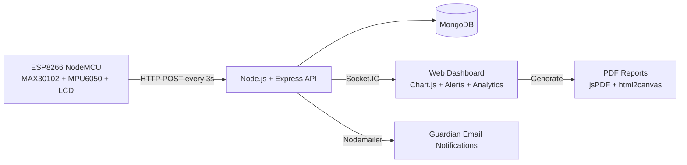

# MediPulse

### Embedded System for Continuous Health Monitoring and Early Warning

[](https://www.espressif.com/)
[](https://nodejs.org/)
[](https://www.mongodb.com/)
[](https://socket.io/)
[](https://www.chartjs.org/)

MediPulse is a full-stack IoT Remote Patient Monitoring (RPM) system that continuously tracks heart rate, SpO2, and body activity, then streams those readings to a real-time clinical dashboard for early warning and rapid response.

Built for affordability and practical deployment, the system combines low-cost embedded hardware with a robust web stack to support home care, rural clinics, and non-critical monitoring scenarios.

## Table of Contents

- [Overview](#overview)
- [Key Features](#key-features)
- [Architecture](#architecture)
- [Tech Stack](#tech-stack)
- [Performance Snapshot](#performance-snapshot)
- [Reliability and Safety Design](#reliability-and-safety-design)
- [Repository Structure](#repository-structure)
- [Source Documents](#source-documents)
- [Use Cases](#use-cases)
- [Future Scope](#future-scope)
- [Team](#team)
- [License](#license)

## Overview

MediPulse follows a three-layer design:

1. Perception Layer: ESP8266 + sensors acquire vitals and activity.
2. Processing Layer: Node.js/Express validates data and stores it in MongoDB.
3. Presentation Layer: Web dashboard renders live updates via Socket.IO.

Clinical support features include risk scoring, alerting, PDF report generation, and guardian email notifications.

## Key Features

- Real-time monitoring of:
	- Heart Rate (BPM)
	- Blood Oxygen Saturation (SpO2 %)
	- Activity level from accelerometer data
- Fall detection using acceleration magnitude threshold (M > 3g)
- Multi-patient dashboard with live trend charts
- Risk score classification: Normal, Warning, Critical
- Role-based authentication: Doctor, Admin, Nurse
- PDF medical report export with chart capture
- Automated guardian/caregiver email reports
- Graceful degradation when MAX30102 is unavailable

## Architecture



## Tech Stack

### Hardware

| Component | Purpose |
|---|---|
| ESP8266 NodeMCU v3 | Main microcontroller and Wi-Fi gateway |
| MAX30102 | Heart rate and SpO2 sensing |
| MPU6050 | Activity monitoring and fall detection |
| 16x2 I2C LCD | Local status and live feedback |
| 4.7k pull-up resistors | I2C line stability |

### Software

| Layer | Technologies |
|---|---|
| Firmware | Arduino IDE, ESP8266 Core, MAX30105 library, MPU6050 library, LiquidCrystal_I2C |
| Backend | Node.js, Express, Mongoose, Socket.IO, Nodemailer |
| Database | MongoDB |
| Frontend | Vanilla JavaScript, Chart.js, jsPDF, html2canvas |

## Performance Snapshot

| Metric | Target | Achieved |
|---|---:|---:|
| SpO2 Accuracy | +/-2% | +/-1.5% |
| Heart Rate Accuracy | +/-5 BPM | +/-3 BPM |
| End-to-End Latency (Sensor to Dashboard) | < 1s | ~380-400ms |
| Data Upload Interval | 3s | 3s |
| Fall Detection Threshold | M > 3g | Achieved |

Additional reported results:

- Fall detection: 10/10 controlled tests triggered alerts within ~400ms
- No false positives during a 30-minute normal walking trial
- API aggregation (~1000 records, 5 patients): ~28ms average
- PDF generation: ~2.8s average
- Email delivery: ~4.2s average

## Reliability and Safety Design

MediPulse is fault-tolerant at the firmware level.

If the MAX30102 pulse oximeter is unavailable, the system continues operation by transmitting accelerometer-based activity data, preserving fall monitoring and partial situational awareness instead of failing completely.

## Repository Structure

```text
.
|-- README.md
`-- CODES/
		|-- ESP8266 CODE.docx
		|-- HTML_CODE.docx
		`-- SERVER.docx
```

## Source Documents

- Frontend: `CODES/HTML_CODE.docx`
- Backend: `CODES/SERVER.docx`
- Firmware: `CODES/ESP8266 CODE.docx`

## Use Cases

- Home-based post-discharge follow-up
- Rural or low-resource care centers
- Elderly care with fall-risk supervision
- Non-critical remote observation settings

## Future Scope

- Add additional sensors (ECG, temperature)
- Miniaturize into a wearable form factor
- Apply ML models for anomaly prediction
- Harden security with HTTPS and end-to-end encryption
- Integrate with EMR/HIS systems
- Scale deployment for multi-ward/multi-hospital monitoring

## Team

- Gandra Sai Nihar
- Menta Suprathik
- Gummaraju Sai Koushik
- Mohanish Gunda
- Bollipalli Mahith Sai
- Ganji Poojitha Lakshmi

## License

No license file is currently included.

If public reuse is intended, add a `LICENSE` file (for example, MIT).
